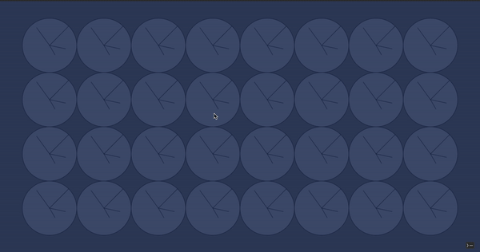

# projet_generative_patterns_2019

This repo holds the projects made by graphic design students @lecolededesign using [p5js](https://p5js.org/).

The course followed by students is an introduction to programming in javascript aimed at exploring interactive and generative patterns. It is available in french [here](https://github.com/b2renger/p5js-designing-interactive-patterns)

Code can be viewed and downloaded on this [github](https://github.com/AtelierNum/projet_generative-patterns_2019) repo.

Cet espace regroupe les projets réalisé par des étudiants en design graphique à l'école de design de Nantes suite à un cours d'introduction à [p5js](https://p5js.org/)

Le cours d'introduction à la programmation en javascript orienté vers la création de motifs interactifs et génératifs est disponible [ici](https://github.com/b2renger/p5js-designing-interactive-patterns)

Le code de ces projets peut-être consulté et téléchargé à partir de ce dépot [github](https://github.com/AtelierNum/projet_generative-patterns_2019)

## Denéchère Théo

Pour ce travail de pattern j’ai décidé de reprendre la fonction seed. 
Elle permet de se perdre dans une infinité de compositions plus ou moins complexes tout en gardant une cohérence globale. 
Le spectateur peut ainsi s’y perdre en créant des illusions parfois psychédéliques. 
Cet effet est renforcé par le choix des couleurs. 
Le rouge et le bleu se répondent en variant d’opacité afin de créer plus ou moins de profondeur, d’éléctricité, de luminosité. 
On vient ensuite taper sur les lettres du clavier pour découvrir des mots, selon la lettre tapée, en rapport avec mon travail et mes compétences.

[https://www.openprocessing.org/sketch/724779](https://www.openprocessing.org/sketch/724779)

## Gillet Pauline

À travers cette représentation, j’ai voulu retranscrire cette dualité qui me caractérise tant. D’un côté la grille, symbolisée par le pavage et de l’autre une forme organique abstraite. Ce mélange entre courbes et lignes symbolise mes deux personnalités, tant perfectionniste que spontané. 
Le pavage fait référence aux motifs inca, culture qui me passionne et m’inspire dans mon travail. 
De même, je me suis inspirée du typographe Louis Stimes, notamment de par sa création du langage singulier, en jouant avec des graisses fortes. 
Ainsi cette réalisation joue avec le cadre établi, ma manière d’appréhendée le design.

[https://www.openprocessing.org/sketch/719257](https://www.openprocessing.org/sketch/719257)

## Girard Romane

Ce code graphique, interactif et génératif est inspiré de la technique des pavages.
Il a été créé pour me présenter. Les formes rondes se superposant permettent de créer différentes ambiances grâce à l’opacité. Elles expriment le fait que je suis adaptable. En effet, c’est la position de la souris qui permet de modifier la superposition des ronds.
La position des traits pouvant créer des carrées exprime mon côté sociable. Il inspire au va-et- viens vers différents points en même temps.
Le cercle de 30 cm de diamètre exprime un trait de caractère qui ne change pas, il s’adapte
en changeant de position selon la souris, mais il est le seul élément qui ne change pas de taille. Dans mon cas, ce trait de caractère est la détermination. C’est pourquoi, c’est un cercle pouvant inspiré à une cible, un objectif à atteindre.
Tous ces éléments changent de position lorsque la souris est en mouvement, mais ils vont vers des directions différentes afin d’exprimer une certaine agilité occupant tout l’espace.

[https://www.openprocessing.org/sketch/724791](https://www.openprocessing.org/sketch/724791)

## Blondel Selma

Ce code génératif est inspiré de mon logo, qui est un logo typographique composé de deux éléments.

Je voulais ici représenter une altercation similaire entre deux éléments géométriques de même forme, force.Autour d'un élément typographique reprenant comme mon logo l'une de mes initiales.

Les deux carrés tournent autour du même point, ils sont attachés l'un à l'autre. 

Tout en étant distinct ils sont donc complémentaires. 
Je souhaitais aussi un projet de code se basant sur des normes numériques colorimétriques éco-conçues. 
Ce pourquoi le background est de couleur sombre et l'on ne peut retrouver que deux éléments de couleur claire et seulement en contour sans remplissage,
qui consomera donc un peu moins d'énergie. 

Ce projet est très simple visuelement mais permet un rendu efficace et varié. 

[https://www.openprocessing.org/sketch/730269](https://www.openprocessing.org/sketch/730269)

## Manchjam Léa

Ce motif génératif met en avant ce que j’ai appris et essayé de mettre en place dans mon travail ces trois dernières années à l’école, à savoir l’importance d’un équilibre entre individualité et collectivité. Une individualité – un style – peut briller, mais au risque d’éclipser le collectif, qui peut produire des résultats qu’on ne pourrait atteindre seuls en travaillant main dans la main. 
Aussi important soit-il de trouver un style qui nous plaît et nous ressemble, il faut être à l’écoute et ouverts aux autres et aux propositions, 
et savoir s’effacer au besoin, au service du collectif.

Inspirations et références : 
		- "Nervous Waves 2" par Levente Sandor : https://www.openprocessing.org/sketch/153224
		- fiches référence des fonctions "map", "noise", et "noiseDetail"

[https://www.openprocessing.org/sketch/729639](https://www.openprocessing.org/sketch/729639)

## Multon Justine

Si je devais me décrire rapidement, les premiers mots qui me viendraient à l’esprit seraient surement coloré, et vintage. 
J’ai donc choisi d’interpréter un motif des années 70, ma décennie de prédilection en terme d’esthétisme, avec un camaïeu de vert d’eau, ma couleur préférée. 
Au delà des motifs créés, j’aime beaucoup l’aspect de l’animation, comme si des yeux attentifs suivaient la souris de l’ordinateur, jusqu’à loucher. 
Je pense que ça rend ce motif un peu absurde !

[https://www.openprocessing.org/sketch/724805](https://www.openprocessing.org/sketch/724805)

## Papillon Guillaume

Grâce à un système de grille et différents éléments modulables, j'ai voulu exprimer plusieurs pans de ma personnalité : 
un dégradé de couleur pour exprimer les nuances de ma personnalité, des cercles qui occultent périodiquement un élément typographique qui me représente (un G en typographie Fraktur) qui grâce à la grille qui se module créer des vagues. 
En résulte une masse mouvante qui se module en couleur, en taille, en concentration.

[https://www.openprocessing.org/sketch/752168](https://www.openprocessing.org/sketch/752168)

## Pierre Robin

Pour débuter ce rendu j’ai débuté par rechercher une réalisation d’artiste. 
J’ai retenu celle de Vera Molnar nommée « Le motif de la montagne Sainte-Victoire ». 
Ce qui m’intéressait c’était les motifs créées par des masses, des lignes verticales 
et des quadrillages ainsi que le contraste bleu/orange. 
À partir de cette référence, j’ai recherché des codes déjà existants comme ces deux là qui créent du mouvement grâce à des lignes regroupées 
dans une grille définie : https://www.openprocessing.org/sketch/582955 
& https://www.openprocessing.org/sketch/710690 
J’ai donc cherché à créer une grille de cases indépendantes. 
Chacune d’entre elle sera composée de lignes horizontales en mouvement automatiques qui se déplacera en fonction de la souris. 

[https://www.openprocessing.org/sketch/719466](https://www.openprocessing.org/sketch/719466)

## Fabarez Justine

Des sphères apparaissent sur l’écran encadrées par de nombreux rectangles, l’ensemble est en movement, en rotation. Les sphères forment tout d’abord une sorte de volute, presque une “tornade” (de part sa forme), les rectangles tournent autour, l’interaction se produit lorsque l’utilisateur bouge sa souris, en haut à gauche les rectangles se font de plus en plus gros jusqu’a prendre toute la page, et plus bas à droite ils rétrécissent tout en continuant leur rotation. On perçoit également par transparence les sphères,(au travers des rectangles).
Le mouvement est discontinu, il ne s’arrête jamais, mais les sphères évoluent dans leur mouvement créant certaine formes, et les mouvements de la souris permettent une évolution des sphères et des rectangles ensembles.
Ce travail me ressemble tout d’abord, dans le choix des couleurs, le bleu et le orange sont deux couleurs ayant un fort contraste elles s’opposent, tout comme la sphère et le rectangle, l’un est rond et doux l’autre est anguleux et plus agressif dans son mouvement. Ces couleurs sont également celle présente dans la charte graphique de mon bachelor.
De plus le travail de rotation et de creation de formes à partir de cela est quelque chose qui me plait car il me semble être assez représentatif de ma vision de la vie, on tourne parfois en rond mais une rencontre, un geste permettent une évolution, un changement, et pour finir j’affectionne particulièrement les éléments permettant à l’utilisateur de se sentir inclue, comme une 3D et c’est ce que j’ai essayé ici de retranscrire.

[https://www.openprocessing.org/sketch/730240](https://www.openprocessing.org/sketch/730240)

## Watrin Romane

Le code suivant prend en compte différents aspects.
D’une part l’aléatoire et d’autre part la supperposition.
Les deux sont exploités car je me suis inspirée du textile. 
Ainsi, l’idée de maille est représentée au travers des ondulations du modules de base qui est un rond.

[https://www.openprocessing.org/sketch/730242](https://www.openprocessing.org/sketch/730242)

## Haremza Julia

Cette réalisation générative tend à représenter mon affinité pour un ensemble de formes que j'affectionne particulièrement. L'usage de contours forts, soulignés par la grille s'inscrit dans la ligne de mon travail par le collage, inspiré par le mouvement Memphis. Le travail de mouvement organique autour de l'arc de cercle est une ouverture sur la conceptualisation de la forme libre, une interpretation interactive et personnelle du travail de Jean Arp, entre autres. Techniqument, le sketch génératif autour d'éléments typographiques à été de grande ressource.	

[https://www.openprocessing.org/sketch/719344/](https://www.openprocessing.org/sketch/719344/)

## Khelifi Farouk

Aussi étrange que cela est, cette production générative représente assez bien ma vision du graphisme, du design, et du monde en générale.
Que voit-on ? Un jolie pavage fait de cercle ? Surement. Des yeux de lézards qui nous observent et clignent quand on veut les fuir ? Peut-être. 
Tout réside dans notre capacité à laisser notre imagination nous guider et suivre son instinct.  
Le monde qui nous entoure nous est imposé, mais l’interprétation que nous en faisons elle, est sans limite.  

Pour ce code, en inspiration directe, j’ai certains motifs et exemple de pavage que vous nous aviez montré.
Je les ai réaliser de nouveaux moi-même, bien que ce fût compliqué, je pense avoir compris.
Et une autre inspiration, ne sachant pas quoi faire exactement (la carte météorologique étant hors sujet après réflexion) on remerciera le remake de la série V en 2009. 
Cette inspiration outre le coté oeil de lézard, c'est surout sommes nous vraiment observés, ou seulement paranoïa

[https://www.openprocessing.org/sketch/730103](https://www.openprocessing.org/sketch/730103)

## Konigsdorfer Marie

Le but était de montrer mon changement de formation 
entre architecture d'intérieur et graphisme,
avec des techniques tirées de la perspective linéale. 
Mon style graphique est structuré, simplifié et lisible.
J'ai voulu aussi mettre en valeur mon envie d'aller vers plus de couleurs dans mes futurs projets.

[https://www.openprocessing.org/sketch/724790](https://www.openprocessing.org/sketch/730103)

## Ines Allombert

Ce projet a pour but de créer un code inspiré de la technique des pavages. 
Pour ce faire, j'ai choisi de présenter une partie cachée et qui se dévoile seulement en déplaçant la souris sur l'écran. 
Un voile qui permet de garder une part de mystère et de chercher à lire la phrase cachée. 
Grâce au clivage mit en place la phrase placée sous le voile est, elle-même, dure à déchiffrer. 
J'ai choisi une phrase du film "les cercles des poètes disparus" pour accompagner mon propos, car le design c'est avant tout des idées et ces idées peuvent un jour changer le monde.

[https://www.openprocessing.org/sketch/719414](https://www.openprocessing.org/sketch/719414)

## Amandine Leroy

J’ai décidé de représenter des ondes qui vibrent et grandissent en fonction du déplacement de la souris. J’ai réalisé quelque chose de très géométrique et symétrique. Les couleurs utilisées sont représentatives de mes projets tout au long de mon cursus scolaire, tout en jouant sur les nuances.

[https://www.openprocessing.org/sketch/725403](https://www.openprocessing.org/sketch/725403)

## Bernaerts Fiona

Une grille typographique utilisant mon nom, prénom et pseudonyme. 
Les mots sont en rotation perpétuelle. Le premier, mon prénom, apparaît dès le lancement du code. 
il faut cliquer avec sa souris ou son pad pour que les deux autres apparaissent.
Le pseudonyme vient s’imbriquer dans le cercle du prénom tandis que le nom de famille se superpose aux deux autres. 
Cela créé une texture typographique entre lignes et angles, rendant la lecture quasi impossible. 
Il ne s’agit pas de savoir comment je m’appelle, mais de comprendre en un rapide coup d’oeil mon style graphique : typographie et avancée infini.

[https://www.openprocessing.org/sketch/724771#](https://www.openprocessing.org/sketch/724771#)

## Bertin Caroline

Cette production est représentative de ma personnalité et de mes projets dans sa structure et ses mouvements. Par sa grille toujours présente, on observe une création ordonnée et structurée dans le fond. Cela donne un aspect sérieux à cette production. 
Dans le détail, on observe du mouvement, dans chaque case de la grille, comme un élément perturbateur à ce calme. Il vient désordonner et apporter de l’aléatoire au visuel. Toujours mené par
le sérieux, l’aléatoire (donc ces ellipses de mouvement) est de la même couleur que les cases de la grille. Rouge (255) et Bleu (255), ces couleurs franches et aussi forte l’une que l’autre se disputent la place dans le visuel. 
Le fond, nuances de noir et blanc, vient calmer cette atmosphère criard et de la neutralité.

[https://www.openprocessing.org/sketch/719300#](https://www.openprocessing.org/sketch/719300#)

## Brossaud Emma

Réalisation de la page d’accueil animée de mon portfolio
en ligne inspirée de mon identité globale. Ma charte graphique est basée sur un rond bleu réalisé à la bombe, sur fond blanc. Le tout est épuré et sensible, à l’image de ce que j’aime : minimalisme et beauté du détail.
La couleur que l’on retrouve sur tous mes supports de communication est le bleu pour sa douceur. My generative self conserve ces mêmes éléments : le bleu/blanc et le rond. L’animation révèle des jeux de superposition, la partie droite est sur fond blanc tandis que la partie gauche est en bleu.

[https://www.openprocessing.org/sketch/729617#](https://www.openprocessing.org/sketch/729617#)

## Buesing Deborah

[https://www.openprocessing.org/sketch/730509](https://www.openprocessing.org/sketch/729617#)

## Dauvé Bastien 

Tout d’abord pour ce qui est des couleurs, ce sont celles que j’utilisent pour mon identité graphique. Ces trois  couleurs représentent les 3 domaines dans lesquelles j’exerce. Le violet pour la vidéo, le rouge pour le graphisme et le vert pour la photo.
Je voulais donc que les différents motifs obtenues puissent évoluer au fûr et à mesure de l’avancée de la souris selon le sens de lecture occidental. Je voulais quelque chose qui soit de plus en plus complexe afin d’obtenir quelque chose qui fasse au final comme une unité lorsqu’on est proche du bas droit de l’écran avec la souris.

[https://www.openprocessing.org/sketch/725391](https://www.openprocessing.org/sketch/725391)

## De La Tribouille Agathe

Les barres se forment de bas en haut ou de haut en bas avec une ondulation des points créant ainsi les lignes, et faisant apparaitre les barreaux.
L'avancement des barres pourraient être semblable de mon point de vue à des périodes de plénitude sans embûches et mauvaises surprises. Elles ondulent jusqu'à former une ligne sans défaut.

[https://www.openprocessing.org/sketch/724772](https://www.openprocessing.org/sketch/724772)

## Gallou Florian

Mon projet s'intitule "ouroboros" traduit par « qui se mord la queue ». 
Il s'agit de 2 lettres "F" & "G" qui se déplacent dans l'espace pour essayer de se synchroniser. // À un instant t elles viennent à s'assembler pour former un logotype. L'utilisateur se rend compte 
qu'il a réussi à former le logo lorsque la couleur change (le logo apparaît blanc). 
C'est un processus cyclique, le logo se forme et et se déforme de manière infinie.

[https://www.openprocessing.org/sketch/719401](https://www.openprocessing.org/sketch/719401)

## Graff Guillaume

Ce code m'inspire l'atmosphère de la musique électronique. Il peut aussi bien représenter un caisson d'enceinte, une onde progressant dans l'air (en "frame by frame") ou une vibration via le jeu de couleur bleu/violet.
(Dans la 3ème boucle for, changer l'itération du map à un random entre 5 et 10 crée une vibration plus vivante mais plus fatiguante pour l'oeil)

[https://www.openprocessing.org/sketch/710882](https://www.openprocessing.org/sketch/710882)

## Guelier Di Giulio Théodore

Ce code représente mon interêt pour la typographie lorsque vous nous avez montrez les motifs que l'on pouvait réaliser avec différentes typographies j'ai vue un écho particulier avec mon travail très axé sur la typographie.

J'ai choisi de mettre en avant la typo Pacifico pour ses empatements et la diversité de motif quel peut créer. 

[https://www.openprocessing.org/sketch/730286](https://www.openprocessing.org/sketch/730286)

## Lenepveu Louise

Le pavage est composé de deux cercles. Le cercle qui se déplace de manière aléatoire est incontrôlable. 
Il représente la créativité. C’est pour moi une composante nécessaire au travail de designer, 
qui malheureusement n’est pas maîtrisable. Le second cercle est contrôlé par la souris, 
il représente la rigueur, la méthodologie et le professionnalisme, ces composantes 
sont elles aussi pour moi essentielles au métier de designer, 
elles ne sont pas innées mais s’acquièrent grâce au travail. 
Ces deux cercles représentent pour la combinaison gagnante pour une bon designer. 
Leur mélange permet avec du temps de créer 
une image entière riche et avec de relief, tout comme le design.

[https://www.openprocessing.org/sketch/725372](https://www.openprocessing.org/sketch/725372)

## Manoury Jules

vague continue = perpetuelle evolution, recherche constante, remise en question
Les vagues représentent pour moi plus qu’un simple phénomene naturel, l’eau symbolise la vie mais aussi la puis- sance. Tout comme le travail qu’effectue le designer la vague se forme, se nourrit grâce aux éléments qui l’en- toure.
La créativité qu’un designer peu se développer, naît de sa propre éducation/culture on parlera dans le cadre de se projet de vague de créativité.

[http://www.openprocessing.org/sketch/719390](http://www.openprocessing.org/sketch/719390)

## Motel Pauline

Des cercles sont disposés sur l’écran de façon symétrique. Lorsque l’utilisateur va interagir avec la souris, ces cercles vont
se multiplier afin de créer des formes abstraites selon le chemin donné par l’utilisateur. Si l’utilisateur clique sur la souris alors,
la création reviendra à son état initial c’est à dire : une nouvelle page blanche afin accueillir une autre production mais aussi une
nouvelle couleur afin de donner une nouvelle identité au rendu créer par le visiteur de la page.
Enfin, cette création me ressemble car elle est minimaliste, graphique et abstraite de part ses couleurs.
Chacun des utilisateurs peut se l’approprier selon son envie, son caractère.
Cette création peut être également qualifiée de douce et poétique, elle va faire voyager l’utilisateur dans un univers parallèle.

[https://www.openprocessing.org/sketch/725373](http://www.openprocessing.org/sketch/719390)

## Charlet Jade

La couleurs accompagne toujours mes projets en graphisme ou même mes projets artistiques, c’est pourquoi mon codes se peint d’un contraste coloré très fort. J’aime aussi les formes géométriques simple et le cercle est une forme mathématique intrigante que j’ai voulue exploité. Les Anneaux de Buren mon beaucoup inspiré pour ce projet.

[https://www.openprocessing.org/sketch/710982](https://www.openprocessing.org/sketch/710982)

## Ruellan Arthur

Questionnement sur le temps accomplis, le temps présent et celui qui reste à venir. Exploration de son impact et de son importance face au quotidien. 

Questionnement sur le temps accomplis, le temps présent et celui qui reste à venir. Exploration de son impact et de son importance face au quotidien. 

Les horloges apparaissent de manières aléatoires.  Le temps peut être accélérer ou bien ralentit voir même inversé grâce aux flèches droites et gauche du clavier. Les horloges peuvent être agrandies ou réduites grâce aux flèches haut et bas du clavier.

Celui ci peut être modulé en fonction de ses envies afin de lui accorder l’importance voulue. La question de quand va s’arrêter l’horloge est aussi à envisager, et encore plus important que le quand,  il s’agit du pourquoi qui semble être la conclusion de cette expérience.

[https://www.openprocessing.org/sketch/731044](https://www.openprocessing.org/sketch/731044)

## Senlis Ambre

Avec la souris au maximum à gauche (x) et au centre (y), les formes sont simples et petites. 
Les cercles blancs représentent le nombre d’actions dont je dois m’occuper en début d’année. Chaque clic nous fait changer d'année.
Elles sont bien distinctes et j’ai une bonne visibilité sur ce qu’il faut que je fasse. Le carré est droit. 
Ces éléments sont le symbole de la simplicité à faire chaque actions. 
Le mouvement de la souris de la gauche vers la droite symbolise le temps qui passe. En faisant bouger la souris vers la droite, les cercles se multiplient et les carrés prennent de la place et tournent sur eux. Cela montre que chaque action devient finalement très complexe. 
En s’accumulant et en se superposant, les formes représentent la perte de gestion de mes actions et un champs de vision brouillé.

[https://www.openprocessing.org/sketch/724994](https://www.openprocessing.org/sketch/724994)

## Lesage Mathéo

Ce code s'inscrit dans une logique d'identité visuelle entre mon portfolio physique, mon cv et mon portfolio en ligne. 
Il est issue des déclinaisons possibles du logo issu de cette charte. Il représente la façon dont je conçois le design,l'organisation de différentes formes dans un espace, qu'il soit mental physique,ect,...

[https://www.openprocessing.org/sketch/724874](https://www.openprocessing.org/sketch/724874)

